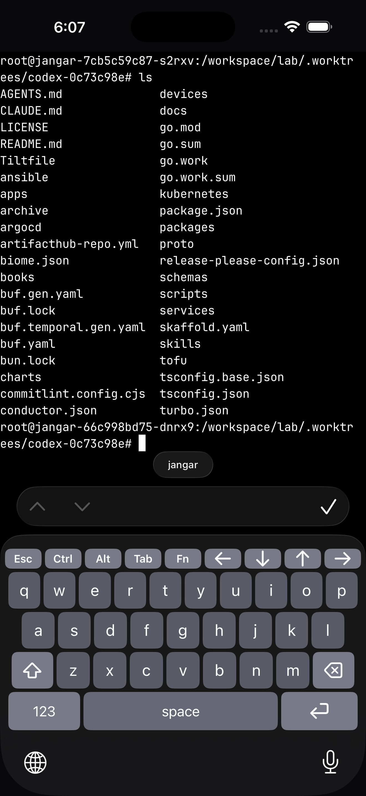

# KeyTerm

Custom iOS keyboard for browser-based terminal sessions.

KeyTerm adds terminal-friendly keys that the default iPhone keyboard is missing: `Esc`, `Ctrl`, `Alt`, `Tab`, arrow keys, and fast symbol access.

## Keyboard Screenshot



## First-Time Setup (Real iPhone)

1. Open `KeyTerm.xcodeproj` in Xcode.
2. Select target `KeyTerm` and set your Team in `Signing & Capabilities`.
3. Select target `KeyTermKeyboard` and set the same Team.
4. Ensure bundle IDs are unique, for example:
   - App: `ai.proompteng.keyterm`
   - Keyboard extension: `ai.proompteng.keyterm.keyboard`
5. Build and Run to your iPhone once.
6. On iPhone, if prompted, enable Developer Mode and restart.
7. On iPhone go to:
   - `Settings -> General -> Keyboard -> Keyboards -> Add New Keyboard...`
   - Choose `KeyTerm Keyboard`.
8. In any terminal input, tap and hold 🌐 (globe) and switch to `KeyTerm Keyboard`.

## Simulator Quick Start

1. Boot a simulator and run the app target `KeyTerm`.
2. Open a text input (for example Safari terminal page).
3. Use `Cmd+K` to show/hide software keyboard in Simulator.
4. Long-press globe key to switch to `KeyTerm Keyboard`.

## Build From Terminal

```bash
xcodebuild \
  -project KeyTerm.xcodeproj \
  -scheme KeyTerm \
  -destination 'generic/platform=iOS' \
  CODE_SIGNING_ALLOWED=NO \
  build
```

## Project Structure

- `Sources/HostApp` - setup app and first-time instructions UI
- `Sources/KeyboardExtension` - custom keyboard implementation
- `project.yml` - XcodeGen project definition

## Troubleshooting

- `Signing requires a development team`:
  - Set Team for **both** `KeyTerm` and `KeyTermKeyboard` targets.
- `No profiles for <bundle id> were found`:
  - Use unique bundle IDs and keep Team consistent on both targets.
- App shows `Not Verified` on iPhone:
  - Make sure iPhone has internet, then open:
    - `Settings -> General -> VPN & Device Management -> Developer App -> Verify App`
- Keyboard not visible in input field:
  - Long-press globe and pick `KeyTerm Keyboard`.
  - In Simulator, ensure software keyboard is enabled with `Cmd+K`.

## Notes

- Arrow keys send ANSI escapes: `ESC [ A/B/C/D`
- `Ctrl` is one-shot and emits ASCII control bytes (example: `Ctrl+C`)
- `Alt` is one-shot and prefixes `ESC`
- `Fn` layer provides 60% navigation mappings
